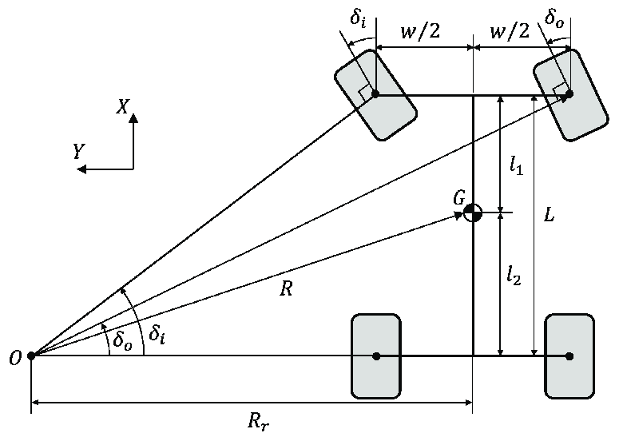

# Lateral Vehicle Dynamics

## Low Speed Cornering

- At low speed, the lateral forces and tyre slip are are negligible. The steering is purely kinematic and all tyres are in rolling condition.

- The ideal turning angle for the front wheels is defined by the Ackermann geometry.

- Since there is negligible tyre slip in this low speed approximation, the wheel heading should be perpendicular to the line joining the centre of the wheel and the turn centre (pivot point).

- With the front wheels heading perpendicular to the connection with the pivot point, the inner wheel has greater steering angle than the outer wheel. So $$\delta _i > \delta _o$$

So, for the inner wheel: 
$$\tan(\delta _i) = \frac{L}{R_r - w/2}$$

By small angle approximation $\tan(\theta) \approx \theta.$ and $R_r \approx R$

$$\delta _i \approx \frac{L}{R - w/2}$$

And for the outer wheel: $$\delta _o \approx \frac{L}{R + w/2}$$

Where $w$ is the "track" of the vehicle, and $R_r$ is the distance from the pivot point to the rear axle centre point while R is the distance between the vehicle centre of mass and the pivot point. Note in this diagram and therefore series of equations, the track and front and rear axle dsitancees from the CoM are defined by different symbols to those described in [Overview.md](./Overview.md#coordinate-definitions).

- In reality, for most road vehicles in everyday use, the steering geometry is close to an Ackermann configuration since they are mostly used in slow corners. This therefore minimises tyre slip as much as possible and reduces the overall tyre wear.

- In Formula 1, an anti-Ackermann geometry is implemented, such that the outer wheels steer more than the inner wheels, producing a greater slip angle and thus generating a higher lateral load, see [Tyres.md](./Tyres.md#lateral-dynamics) for supporting theory. This comes with the trade-off of increased tyre slip and therefore tyre wear at low-speed corners.

- Finally, we can define the Ackermann angle as the average of the inner and outer wheel steer: $$\delta \approx \frac{L}{R}$$

