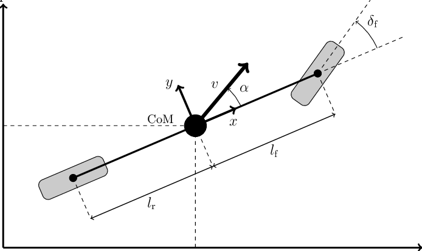
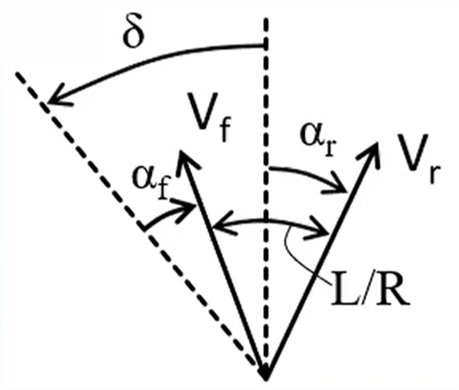
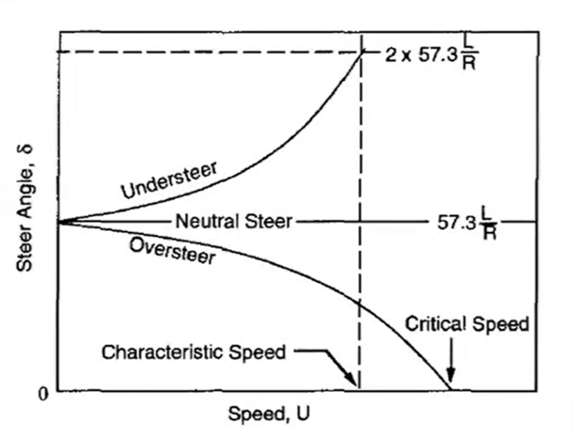
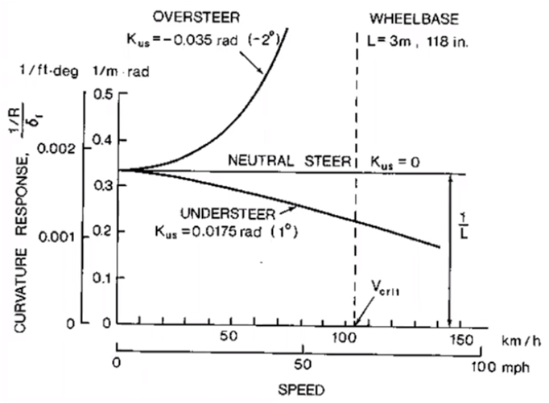
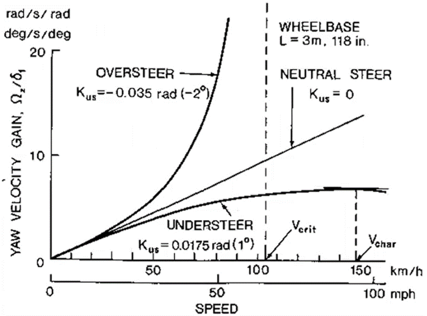
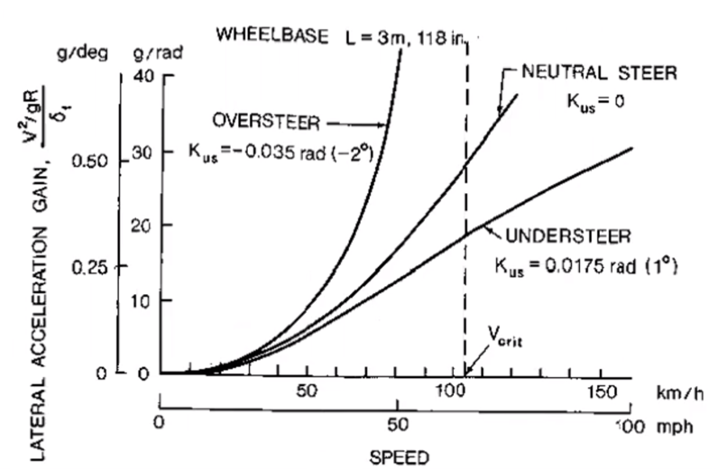

# Lateral Vehicle Dynamics

## Low Speed Cornering

- At low speed, the lateral forces and tyre slip are are negligible. The steering is purely kinematic and all tyres are in rolling condition.

- The ideal turning angle for the front wheels is defined by the Ackermann geometry.

- Since there is negligible tyre slip in this low speed approximation, the wheel heading should be perpendicular to the line joining the centre of the wheel and the turn centre (pivot point).

- With the front wheels heading perpendicular to the connection with the pivot point, the inner wheel has greater steering angle than the outer wheel. So $$\delta _i > \delta _o$$

So, for the inner wheel: 
$$\tan(\delta _i) = \frac{L}{R_r - w/2}$$

By small angle approximation $\tan(\theta) \approx \theta.$ and $R_r \approx R$

$$\delta _i \approx \frac{L}{R - w/2}$$

And for the outer wheel: $$\delta _o \approx \frac{L}{R + w/2}$$

Where $w$ is the "track" of the vehicle, and $R_r$ is the distance from the pivot point to the rear axle centre point while R is the distance between the vehicle centre of mass and the pivot point. Note in this diagram and therefore series of equations, the track and front and rear axle dsitancees from the CoM are defined by different symbols to those described in [Overview.md](./Overview.md#coordinate-definitions).

- In reality, for most road vehicles in everyday use, the steering geometry is close to an Ackermann configuration since they are mostly used in slow corners. This therefore minimises tyre slip as much as possible and reduces the overall tyre wear.

- In Formula 1, an anti-Ackermann geometry is implemented, such that the outer wheels steer more than the inner wheels, producing a greater slip angle and thus generating a higher lateral load, see [Tyres.md](./Tyres.md#lateral-dynamics) for supporting theory. This comes with the trade-off of increased tyre slip and therefore tyre wear at low-speed corners.

- Finally, we can define the Ackermann angle as the average of the inner and outer wheel steer: $$\delta \approx \frac{L}{R}$$

## Bicycle Model

- Consider the simplification that the vehicle axle track is zero, and therefore that we only have 1 axis, a bicycle.

- **This vehicle model has 2 degrees of freedom, they are the lateral position, y, and the yaw rate, r, which is the rotation about the z-axis perpendicular to the plane of motion (x,y).**

- The lateral position is defined in a moving coordinate system, (x,y) such that the vehicle heading direction is always in the x direction, and the y direction is perpendicular.

- This vehicle model is considered to have a constant longitudinal velocity.

- The front wheel steering angle is considered the only other input alongside the constant velocity.

- By applying lateral force equilibrium and momentum equilibrium we can deduce the following characteristic equations:

    - Lateral force equilibrium: $$F_{yf} \cdot \cos(\delta) + F_{yr} = m \cdot a_y$$

    - Momentum equilibrium: $$F_{yf} \cdot \cos(\delta) \cdot l_f - F_{yr} \cdot l_r = I \cdot \dot{r}$$

    - Recall r is the yaw rate (rotation about the z-axis).
    
    - Note $F_y$ is a function of slip angle and normal force for front and rear axles:
        - $F_{yf} (\alpha _f, N_f)$ 
        - $F_{yr} (\alpha _r, N_r)$.

### Lateral Acceleration

- Acceleration due to rotation: $a_{y,rotation} = \frac{V^2}{R}$

- Since $V = r \cdot R$, $$a_{y,rotation} = r \cdot V$$

- For pure vehicle sliding we have $$a_{y,sliding} = \ddot{y}$$

- Therefore, for total acceleration: $$a_y = a_{y,rotation} + a_{y,sliding}$$ $$a_y = r \cdot V + \ddot{y}$$

### Slip Angles

- Once again we will utilise the small angle approximation. $\tan(\theta) \approx \theta$.

- Front slip angle is given by $$\alpha_{f} = \arctan(\frac{v_{yf}}{v_x}) - \delta \approx \frac{v_{yf}}{V} - \delta$$

- Note also that $v_{yf} = v_y + r \cdot l_f$

- Therefore: $$\alpha_{f} = \frac{v_y + r \cdot l_f}{V} - \delta$$

- Rear slip angle is given by $$\alpha_{r} = \arctan(\frac{v_{yr}}{v_x}) \approx \frac{v_{yr}}{V}$$

- Note also that $v_{yr} = v_y - r \cdot l_r$

- Therefore: $$\alpha_{r} = \frac{v_y - r \cdot l_r}{V} - \delta$$

- Recall the velocity in the y direction can also be expressed as $\dot{y}$.

- The vehicle slip angle at the centre of gravity can also be defined as $$\beta = \arctan(\frac{v_{y}}{v_x}) \approx \frac{v_{y}}{V}$$

### Bicycle Model Equations

- The lateral force equilibrium equation therefore becomes:

$$F_{yf}(\frac{\dot{y} + r \cdot l_f}{V} - \delta) \cdot \cos(\delta) + F_{yr}(\frac{\dot{y} - r \cdot l_r}{V} - \delta) = m \cdot (r \cdot V + \ddot{y})$$

- The momentum equilibrium equation therefore becomes:

$$F_{yf}(\frac{\dot{y} + r \cdot l_f}{V} - \delta) \cdot \cos(\delta) \cdot l_f - F_{yr}(\frac{\dot{y} - r \cdot l_r}{V} - \delta) \cdot l_r = I \cdot \dot{r}$$

- Inputs:
    - Vehicle velocity: V
    - Steering wheel input: $\delta$
- Outputs:
    - Side slip (lateral velocity): $\beta$ ($\dot{y}$)
    - Yaw rate: r
    - Lateral acceleration: $a_y = r \cdot V + \ddot{y}$

### Trajectory

- Definition of the vehicle path, using global X,Y coordinates (not to be confused with the local x,y coordinate system of the vehicle itself).

- The relationship between these coordinate systems is given by trigonometric identities, assuming the angle $\Psi$ between the x and X axes (and therefore the y and Y axes also). 
$$X = x \cdot \cos(\Psi) - y \cdot \sin(\Psi)$$
$$Y = x \cdot \sin(\Psi) + y \cdot \cos(\Psi)$$

- With x, y and $\Psi$:
    - $x = \int_0^t V \cdot dt = V \cdot t$
    - $y = \int_0^t \dot{y} \cdot dt$
    - $\Psi = \int_0^t r \cdot dt$

### Linearisation (Derivatives Approach)

- Linear tyre model: Tyre force proportional to the slip angle. $F_y = C_\alpha \cdot \alpha, (C_\alpha < 0)$

- Small angle approximation: $\cos(\delta) = 1$

- Vehicle sideslip considered: $\beta = \arctan(\frac{v_y}{v_x} \approx \frac{v_y}{V})$

- Lateral force equilibrium: $$(C_{\alpha f} + C_{\alpha r}) \cdot \beta + (C_{\alpha f} \cdot l_f - C_{\alpha r} \cdot l_r) \cdot \frac{r}{V} - C_{\alpha f} \cdot \delta = m \cdot V \cdot (r + \dot{\beta})$$

- Momentum equilibrium: $$(C_{\alpha f} \cdot l_f - C_{\alpha r} \cdot l_r) \cdot \beta + (C_{\alpha f} \cdot l_{f}^2 + C_{\alpha r} \cdot l_{r}^2) \cdot \frac{r}{V} - C_{\alpha f} \cdot l_f \cdot \delta = I \cdot \dot{r}$$

## Steady State Response

- Test to understand the vehicle response and grip level and the understeer balance.

- Vehicle in steady state cornering conditions: "Slow" steering input and/or velocity change so the vehicle goes from one equilirbium position to another.

- Tests:
    - Constant radius test (closed loop) with increasing speed and therefore steering input to maintain the constant radius. (Requires a driver model to simulate).
    - Constant speed test (open loop) with steady increase ramped steering input.

### Understeer & Oversteer

- Understeer can be seen when a vehicle is losing grip at the front axle before the rear axle, resulting in the driver demanding more steering input to achieve the desired rotation/cornering performance of the car.

- Oversteer can be seen when a vehicle is losing grip at the rear axle before the front axle, resulting in the driver demanding less steering input or countersteering with opposite lock to achieve the desired cornering performance.

- In higher speed cornering, the front and rear tyres begin to slip, and the centre of rotation, or pivot point shifts.

- The vehicle steer angle is related to the front and rear slip angles: $$\delta \approx \frac{L}{R} + (\alpha _f - \alpha _r)$$

- The steering input from a driver is a combination of Ackermann steering (kinematic steering) and additional steer to compensate for the vehicle balance between front and rear axles (understeer and oversteer behaviour).

- Definition of the Understeer Gradient ($K_{US} \ [deg/ms^{-2}]$): $$\delta = \frac{L}{R} + K_{US} \cdot a_{y}$$

$$K_{US} = \frac{\partial \delta}{\partial a_{y}} - \frac{\partial \delta_{ackermann}}{\partial a_{y}}$$

- Considering the linearised bicycle model we have: 

$$K_{US} = (\frac{m \cdot l_r}{L \cdot C_{\alpha f}} - \frac{m \cdot l_f}{L \cdot C_{\alpha r}}) = (\frac{m_f}{C_{\alpha f}} - \frac{m_r}{C_{\alpha r}})$$

- With:
    - $m_f$ = Front axle mass.
    - $m_r$ = Rear axle mass.
    - $C_{\alpha f}$ = Front axle cornering stiffness.
    - $C_{\alpha r}$ = Rear axle cornering stiffness.

- Neutral Vehicle:
    - $K_{US} = 0$
    - $\alpha_{f} = \alpha_{r}$
    - $m_{f}/C_{\alpha f} = m_{r}/C_{\alpha r}$

    - The neutral vehicle setup allows the driver to maintain the steering input at a constant level to keep the cornering radius independently of the speed.
    - This balance setup allows a driver to extract the most performance from a vehicle, as both axles reach the limit simultaneously.

- Understeer Vehicle:
    - $K_{US} > 0$
    - $\alpha_{f} > \alpha_{r}$
    - $m_{f}/C_{\alpha f} > m_{r}/C_{\alpha r}$

    - The understeer bias vehicle setup requires the driver to increase the steering input as vehicle speed increases in order to maintain a constant turning radius.
    - In this balance, the front axle is the limiting factor and the vehicle is easier to control, but is not reaching peak cornering performance.
    - This balance is common in standard road cars.

- Oversteer Vehicle:
    - $K_{US} < 0$
    - $\alpha_{f} < \alpha_{r}$
    - $m_{f}/C_{\alpha f} < m_{r}/C_{\alpha r}$

    - The oversteer bias vehicle setup requires the driver to reduce the steering input as vehicle speed increases in order to maintain a constant turning radius.
    - In this balance, the rear axle is the limiting factor and the vehicle is harder to control with risk of spinning, but is not reaching peak cornering performance.

- Factors effecting Understeer Gradient: $$K_{US} = (\frac{m_f}{C_{\alpha f}} - \frac{m_r}{C_{\alpha r}})$$ 
    - Weight distribution.
    - Axle cornering stiffness.
        - Tyre cornering stiffness.
        - Roll steer.
        - Roll camber.
        - Suspension compliance.
    - Lateral load transfer and roll stiffness distribution.
    - Application of driving or braking forces.

### Critical & Characteristic Speed

- For the constant radius test we can define the charactistic and critical speeds.

- Characteristic speed:
    - For an understeer vehicle, the characteristic speed is defined as the speed at which the steering angle required is double the Ackermann angle. $$v_{char} = \sqrt{\frac{gL}{K_{US}}}$$

- Critical speed:
    - For an oversteer vehicle, the critical speed is defined as the speed at which the steering angle changes sign (the point at which the driver will be required to input counter-steer or opposite lock). At speeds greater than the critical speed the vehicle is unstable. $$v_{crit} = \sqrt{\frac{gL}{-K_{US}}}$$
    - Recall that $K_{US}$ is the understeer gradient, and so for an oversteer vehicle this coefficient has a negative sign.

- It is desirable for the characteristic or critical speed to be as large as possible. If an oversteer vehicle has a low critical speed then it will become difficult to control and therefore will not perform optimally.

### Curvature Response Gain

- For the constant radius test we can define the curvature response gain. $$\frac{1/R}{\delta} = \frac{1}{L + K_{US} \cdot \frac{V^2}{g}}$$

- Neutral Vehicle ($K_{US} = 0$):
    - Curvature is independent of speed.

- Understeer Vehicle ($K_{US} > 0$):
    - Curvature response gain decreases with speed.

- Oversteer Vehicle ($K_{US} < 0$):
    - Curvature response gain increases with speed and becomes infinite at $v_{crit}$ where the vehicle is spinning.

### Yaw Rate Gain

- For the constant radius test we can define the yaw rate gain. $$\frac{r}{\delta} = \frac{V}{L + K_{US} \cdot \frac{V^2}{g}}$$

- Neutral Vehicle ($K_{US} = 0$):
    - Yaw rate gain increases linearly with speed.

- Understeer Vehicle ($K_{US} > 0$):
    - Yaw rate gain increases with speed (at a decreasing rate) and reaches a maximum at $v_{char}$.

- Oversteer Vehicle ($K_{US} < 0$):
    - Yaw rate gain increases exponentially with speed and becomes infinite at $v_{crit}$.

### Lateral Acceleration Gain

- For the constant radius test we can define the lateral acceleration gain. $$\frac{a_{y}}{\delta} = \frac{V^2}{g \cdot L + K_{US} \cdot V^2}$$

- Neutral Vehicle ($K_{US} = 0$):
    - Lateral acceleration increases with the square of the speed.

- Understeer Vehicle ($K_{US} > 0$):
    - Lateral acceleration gain increases with speed and approaches a constant value asymptotically for large speeds.

- Oversteer Vehicle ($K_{US} < 0$):
    - Lateral acceleration gain increases with speed and becomes infinite at $v_{crit}$ where the vehicle is unstable and spinning.

### Neutral Steer Point

- The neutral seer point, NSP, is the point at which an external lateral force produces no yaw velocity, only lateral displacement. $$NSP = \frac{d}{L} = \frac{C_{\alpha r}}{C_{\alpha f} + C_{\alpha r}}$$

    - Where d is the distance from the NSP to the front axle and $C_{\alpha}$ is the relevant axle cornering stiffness. 

- It is important to consider the position of this on a vehicle when considering aerodynamic performance, as it is undesirable to position aerodynamic components in such a way that an external lateral force, such as wind, causes the vehicle to turn or rotate unpredictably.

- The ratio of the distance between the NSP and the centre of mass (CoM or CoG) is defined as the Static Margin. $$SM = \frac{d - l_{f}}{L} = NSP - \frac{l_{f}}{L}$$

    - Where d is the distance from the NSP to the front axle, and $l_{f}$ is the distance from the CoM to the front axle.

## Transient Response

