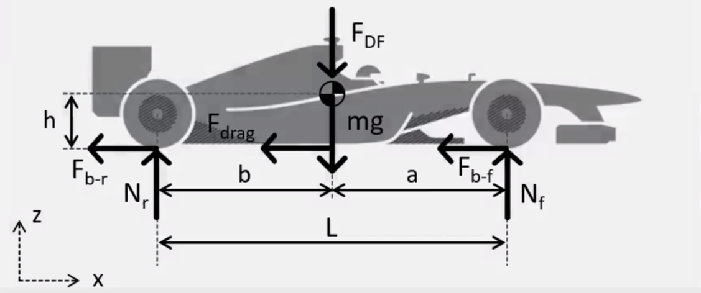
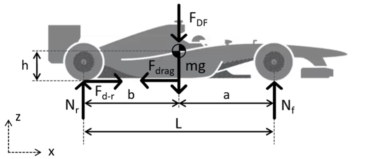

# Longitudinal Vehicle Dynamics

## Braking Performance

### Equations of Motion

In order to obtain the equations of motion for braking performance in the longitudinal plane, we first make the assumptions that the aerodynamic downforce is applied at the centre of gravity of the vehicle, and that the drag force is applied at ground height. The resulting equilibrium force equations are as follows for the diagram below:

- Longitudinal Force Equilibrium $$-[F_{brake-f(\kappa_{f},N_{f})} + F_{brake-r(\kappa_{r},N_{r})} + F_{drag}] = m \cdot a_{x}$$

- Vertical Forces Equilibrium $$N_{f} + N_{r} - F_{DF} - m \cdot g = 0$$

- Equilibrium of moments and the centre of gravity $$-N_{f} \cdot a + N_{r} \cdot b + (F_{brake-f} + F_{brake-r} + F_{drag}) \cdot h = 0$$

Here, N represents the normal force at the front and rear axle specified by subscript index.

Note the negative sign for the longtidinal force equilibrium due to the direction of braking forces and drag acting against the vehicle motion, defined to be positive when going forwards as shown in the diagram above.

### Load Transfer

Verticle Load:

- Front Axle: $$N_{f} = \frac{m \cdot g \cdot b}{L} + \frac{F_{DF} \cdot b}{L} - \Delta F_{z}$$

- Rear Axle: $$N_{r} = \frac{m \cdot g \cdot a}{L} + \frac{F_{DF} \cdot a}{L} + \Delta F_{z}$$

The first term in each equation corresponds to the static load (vehicle mass), with the second and third terms representing the aerodynamic downforce and load transfer respectively.

- Load Transfer: $$\Delta F_{z} = m \cdot a_{x} \cdot \frac{h}{L}$$ with
$$a_{x} < 0$$

As the vehicle is braking, the transfer of load between the front and rear axles is such that the front axle verticle load increases, while the rear axle verticle load decreases.

### Maximum Deceleration

The maximum deceleration is achieved when both the front and rear axles are at the traction limit. In high-performance motorsport application, it is desirable to achieve the maximum possible braking performance in the vehicle design and setup.

- $F_{brake-f} = \mu \cdot N_{f}$
- $F_{brake-r} = \mu \cdot N_{r}$

With $\mu$ the coefficient of friction and N the normal force. Thus, the maximum deceleration can be calculated: $$a_{x-max} = -\mu \cdot \frac{(m \cdot g + F_{DF})}{m} - F_{drag}$$

Considering a scenario with no aerodynamic effects, this simplifies to $$a_{x-max} = -\mu \cdot g$$

It is therefore clear to see that the maximum deceleration is dependent upon the grip level, vehicle mass, and vehicle aerodynamics. Optimising these parameters to achieve high grip level, low mass, and high aerodynamic downforce while minimising drag will maximise the deceleration performance.

### Brake Balance

To achieve the theoretical maximum deceleration of a vehicle, the braking system needs to be setup accordingly, that is, obtaining the correct ratio of front and rear braking forces. 

- Considering the aerodynamic forces are significant, then the ideal braking ration becomes speed dependant, since the downforce and drag forces are speed dependent: $$\beta_{P} = \frac{(m \cdot g + F_{DF}) \cdot b - m \cdot h \cdot a_{x}}{(m \cdot g + F_{DF}) \cdot a + m \cdot h \cdot a_{x}}$$

and $$a_{x-max} = -\mu \cdot \frac{(m \cdot g + F_{DF})}{m} - F_{drag}$$

- Considering no aerodynamic forces, the ideal brake ratio is given as: $$\beta_{P} = \frac{F_{brake-f}}{F_{brake-r}} = \frac{\mu \cdot N_{f}}{\mu \cdot N_{r}} = \frac{b + \mu \cdot h}{a - \mu \cdot h}$$

We can also consider the brake balance, defined as the ratio between the front axle braking force and the total braking force of the vehicle (both axles).

- Brake balance: $$\beta_{balance} = \frac{F_{brake-f}}{F_{brake-f} + F_{brake-r}} = \frac{\beta_{P}}{\beta_{P} + 1}$$

### Brake Model

The model of the braking system is such that the brake pedal position, resulting from the driver input, must be converted to the appropriate amount of front and rear brake torque, depending on the brake bias setup, each of which subsequently translates to front and rear tyre longitudinal force.

Considering first the pedal position to brake torque conversion process, the following considerations are required:

- The normalised brake pedal position, $Brake$, is given as an input. Consider no braking input = 0, and full braking input = 1.
- The ratio of brake pedal displacement to braking torque $r_{brake}$.
- The brake balance $\beta_{balance}$.

Resulting in a front breaking torque of $$\Gamma_{brake-f} = Brake \cdot r_{brake} \cdot \beta_{balance}$$

and rear braking torque $$\Gamma_{brake-r} = Brake \cdot r_{brake} \cdot (1 - \beta_{balance})$$

Now considering the translation of the front and rear axle braking torque into front and rear tyre longitudinal braking forces:

- For a wheel angular momentum $\Omega$ and inertia $I_{wheel}$, with wheel centre velocity $v_{x}$, the equilibrium of moments is given as $$F_{brake} \cdot r - \Gamma_{brake} = I_{wheel} \cdot \dot{\Omega}$$

    - Note that r is the radius from contact patch to wheel centre, and that $F_{brake}$ will be in the negative x direction, as it acts against the direction of motion.

- The tyre longitudinal force is dependent on the normal force N and the slip ratio $\kappa$.

- Recall $\kappa = \frac{\Omega \cdot r - v_{x}}{v_{x}}$

## Driving Performance

### Equations of Motion

In order to obtain the equations of motion for driving performance in the longitudinal plane, we first make the assumptions that the aerodynamic downforce is applied at the centre of gravity of the vehicle, and that the drag force is applied at ground height. In addition, the assumption is of a rear-wheel drive vehicle (as is most common in motorsport). The resulting equilibrium force equations are as follows for the diagram below:

- Longitudinal Force Equilibrium $$F_{drive-r(\kappa_{r},N_{r})} - F_{drag} = m \cdot a_{x}$$

- Vertical Forces Equilibrium $$N_{f} + N_{r} - F_{DF} - m \cdot g = 0$$

- Equilibrium of moments and the centre of gravity $$-N_{f} \cdot a + N_{r} \cdot b - (F_{drive-r(\kappa_{r},N_{r})} - F_{drag}) \cdot h = 0$$

