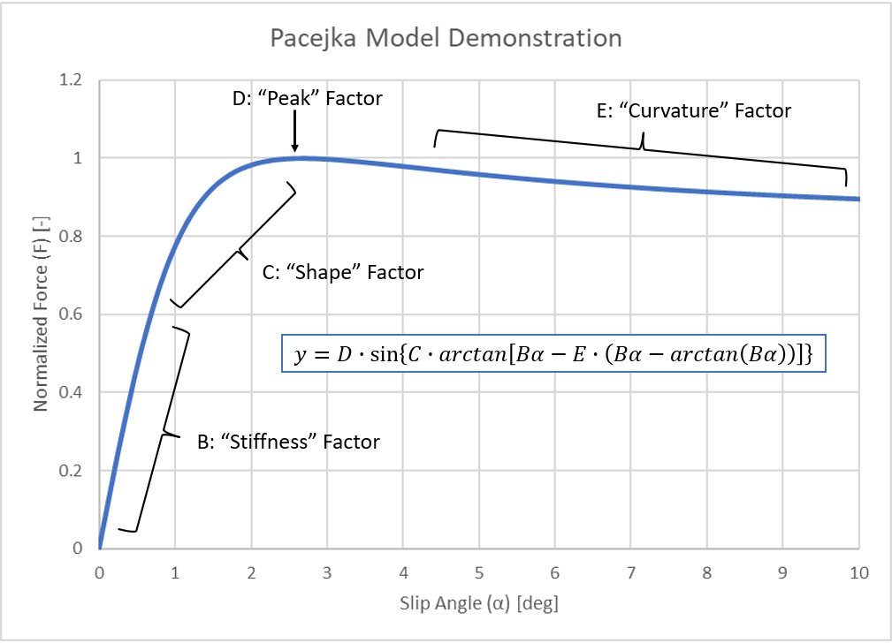

# How Do Tyres Work?

## Overview

Tyre behaviour is key in vehicle dynamics since they are the primary source of force and torque acting on the vehicle, with the exception of aerodynamics.

Tyre Factors:

- V = Longitudinal speed
- $\Omega$ = Rotational velocity
- $\alpha$ = Slip angle
- $F_{x}$ = Longitudinal force (x-plane)
- $F_{y}$ = Lateral force (y-plane)
- $M_{z}$ = Aligning torque (about the z-axis)

A tyre interaction with the road happens over a "contact patch" - the tyre behaviour is non-linear. Since this behaviour is non-linear, we can't use the Coulomb friction principle.

 Tyre Grip Mechanisms:

- Adhesive Friction, Mechanical purchase between irregularities acting in a similar manner to a gear mechanism.
- Hysteretic friction, Chemical bonding as a result of the tyre material (rubber).

 Pressures:

- Tyres carry the vertical load of a vehicle as a result of the inflation pressure.
- Tyre inflation pressure is essential to ensuring adequate pressure distribution across the surface of the tyre and therefore avoid excessive localised wear.
- If a tyre is under-inflated, the bulk of the load will be carried on the outer perimeter of the tyre, whereas for over-inflation the bulk load is carried along the centre line of the tyre.
- Appropriate tyre inflation presssure ensures a maximised contact patch and even pressure distirbution, which improves grip and wear.

## Lateral Dynamics

- A tyre generates a lateral force that is dependant on the slip angle $\alpha$. Recall this slip angle is defined to be the angle between the wheel heading and the direction of motion.

- As slip angle increases, so to does the lateral force generated up to a given peak, before falling back down. This is described in several phases:
    - Elastic (linear) phase: Lateral force increases directly proportionally to the increasing slip angle.
    - Transitional phase: The lateral force continues to increase as the slip angle is increased, at a non-linear rate however.
    - Frictional phase: After the peak in lateral force, the frictional phase describes a drop in lateral force as the slip angle continues to increase. In this phase, the vehicle is sliding and has reduced control.

- Driving a car at the peak of lateral grip can therefore be challenging, given the drop off in the frictional phase as the car begins to slide. This is what is often referred to as "driving on the limit."

 - The contact path of the tyre deforms as a result of the lateral forces applied to the tyre.

 - The relationship between tyre slip angle and velocity components in the x and y plane is described by trigonometry as $\tan(\alpha) = \frac{v_y}{v_x}$.

    - $v_y$ represents the lateral velocity, while $v_x$ is the longitudinal velocity.

- The sum of lateral force $F_y$ components on the contact patch acts at a point slightly to the rear of the tyre compared to the centre line (in the vertical z plane). This results in a moment, or torque, being created about the vertical z-axis, acting to align the tyre heading with the direction of travel, thus acting to reduce the slip angle $\alpha$. This is the aligning torque, $M_z$.

- Increasing the vertical load on a tyre increases its capacity to generate lateral force - translating to more grip in corners. This relationship is not linearly proportional however. There is a reduction in efficiency as the vertical load is increased. We can describe this with a lateral force coefficient $\frac{F_y}{F_z}$. As $F_z$ is increased, this coefficient peak decreases, meaning a loss of normalised performance for increasing vertical loads, despite an increase in lateral force performance for greater vertical loads. This is an example of diminishing returns.

- Vertical tyre load changes must therefore be avoided due to this loss of normalised performance with increasing vertical load. An improtant consideration in the design of vehicle suspension, for example.

- Camber is the angle of inclination between the vertical axis of the tyre/wheel, and the vertical z-axis of the vehicle. For example, if the top of the tyre is angled inwards to the vehicle, and the bottom of the tyre is angled away from the vehicle, there is a negative angle of camber. Optimising this camber angle generates additional lateral force (camber thrust) by increasing the contact patch, but must also act to limit tyre wear, as too much camber will cause excessive wear.

## Longitudinal Dynamics

- Tyres generate longitudinal forces dependant on the slip ratio $\kappa$.

- The longitudinal force experiences a maximum, or peak, for a given slip ratio, typically between 10% and 20%, before then seeing a drop off as the tyre/wheel is spins or slides.

- The relationship between longitudinal force and slip ratio varies for different operational scenarios, namely, between traction and braking scenarios. Driving assistance control systems and software, such as traction control and anti-lock braking systems, are implemented as a means of ensuring the vehicle remains in the peak traction or braking performance window - that is, to ensure peak longitudinal force for each operational scenario.

- We define the slip ratio to be the ratio between the difference in theoretical wheel velocity and real wheel velocity, and the real wheel velocity: $$\kappa = \frac{\Omega \cdot r - v_x}{v_x}$$

    - With: $\Omega$ = Wheel angular velocity.
            r = Effective tyre radius.
            $v_x$ = Wheel centre lognitudinal speed.

- The effective tyre radius varies depending on the vertical load and the rolling condition!

- For a braking scenario: $\kappa < 0$ since $\Omega \cdot r < v_x$.
- For a driving scenario: $\kappa > 0$ since $\Omega \cdot r > v_x$.

## Combined Forces

- Tyres lose lateral dynamic performance as a longitudinal force is generated. Similarly, a tyre will lose longitudinal dynamic performance as lateral forces are generated. This is because a tyre will have a finite capacity for grip, or  the overall generated force vector, with the directional components of this generated force being in the lateral and longitudinal directions. Thus, we see a compromise between lateral and longitudinal forces and grip, as each vector component must sum to equal the overall force vector generated by the tyre, which will have a natural limit. In this sense, we can understand why rear-axis drivetrains might be preferred over front-axis drivetrains, in an effort to balance the lateral and longitudinal force components on the tyres by demanding primarily longitudinal force on the rear, and lateral on the front.

- The friction elipse defines the maximum force a tyre can generate overall (vector component sum), and in each directional component.

- Using a g-g diagram, measurements of lateral and longitudinal forces on a vehicle around a circuit can be observed, with lateral acceleration (g) on the x-axis, and longitudinal acceleration on the y-axis.
    - In this type of plot, it is common to observe a limitation in the negative region of longitudinal accelaration, since this is typically limited more so by the powertrain than the tyre. Thus, force experienced under braking is typically greater in magnitude than that during a "driving scenario."

# Tyre Models

## Linear Tyre Model

- The most simple tyre model, whereby the magnitude of lateral force increases linearly with an increasing side slip angle $\alpha$.

- The gradient for this linear relationship is described as the cornering stiffness $C_\alpha$.

- This model does not capture the non-linearities of a tyre, and therefore is limited. In the case of modelling small slip angles, this model may be applied, recalling the linear/elastic phase discussed in the [Lateral Dynamics](#Lateral-Dynamics) section.

- Depending on sign conventions, the cornering stiffness $C_\alpha$ can be negative or positive.

## Pacejka Tyre Model

- The Pacejka model is a semi-empirical tyre model, also known as Magic Formula, given as: $$y(x) = D \cdot sin(C \cdot atan[B \cdot x - E \cdot (B \cdot x - atan(B \cdot x))])$$

    - $y(x)$ = Output, $F_x$ or $F_y$.
    - $x$ = Input, $\kappa$ or $\alpha$.
    - B = Stiffness Factor.
    - C = Shape Factor.
    - D = Peake Value.
    - E = Curvature Factor.

- From this model, we can determine key tyre performance parameters in the following ways:

    - Cornering Stiffness: $C_\alpha = atan(BCD)$.
    - Horizontal Asymptote: $y_a = D \cdot sin(C \cdot \frac{\pi}{2})$.
    - Peak Value $(x_m,y_m)$:
        - $y_m = D$.
        - $B \cdot (1-E) \cdot x_m + E \cdot atan(B \cdot x_m) = tan(\frac{\pi}{2C})$.
    - Maximum Value (load dependent):
        - $D = (a_1 \cdot F_z + a_2) \cdot F_z$
        - $a_1 < 0$

- In reality, it would be expected that tyres are not perfecetly symmetric, and thus may not cross the origin (0,0) point as shown in the graph below. We might therefore want to indtroduce a tyre shift complexity to the model in the following way: $$y(x) = D \cdot sin(C \cdot atan[B \cdot (x+S_H) - E \cdot (B \cdot (x+S_H) - atan(B \cdot (x+S_H)))]) + S_V$$

    - This tyre shift introduces a defined translation of the curve to adjust the model in-line with vehicle and tyre conditions as necessary.

- This model can be used to fit real data, in turn, determining the various parameters defined above.

1. Set the peak value: $D = y_m$.
2. Calculate the shape factor: $C = 2 - \frac{2}{\pi} \cdot asin(\frac{y_a}{D})$.
3. Obtain the stiffness factor: $B = \frac{C_\alpha}{C \cdot D}$.
4. Determine the curvature factor: $E = \frac{tan(\frac{\pi}{2C}) - B \cdot x_m}{atan(B \cdot x_m) - B \cdot x_m}$

## Other Tyre Models

- MF-Tyre: Implementation of the Magic Formula with additional parameters relating to camber angle, pressure and more. Fitted from real tyre data, and directed towards vehicle handling applications.

- MF-Swift: High frequency extension to the MF-Tyre model with the addition of a 3D tyre envelope and tyre belt, directed towards ride comfort, road load and vibration analysis applications.

- F-Tire: Physical tyre model (no longer semi-empirical) with flexible tyre structure for high-frequency excitation. Directed towards ride comfort, road load and vibration analysis in the automotive industry.

- CD-Tyre: Physical tyre model with different models for belt, sidewall and tread, includes thermal effects and high-frequency accuracy. Directed towards handling, ride comfort and durability applications.

