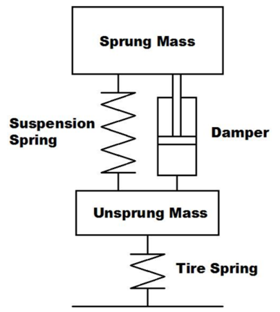

# Vehicle Suspension

## The Role of Suspension

- Comfort: Isolate the vehicle body from the road inputs.
- Performance: Minimise the tyre vertical load variation.
- Performance: Maintain the optimum tyre camber and steer angles.
- Aerodynamics: Maintain the vehicle body altitude (ride height) and attitude (relative angle between the body and the ground, also known as rake).

For a high performance vehicle like an F1 car, the comfort is unimportant, wherease the performance and aerodynamics are prioritised. In a commercial application, comfort is a priority for everyday driving applications.

## Sprung and Unsprung Mass

- Sprung Mass: The portion of the vehicle mass supported by the suspension. This includes the body, frame, powertrain, driver and more.

    - Since the sprung mass is supported by the suspension, its movement can be controlled via appropriate suspension tuning.
 
 - Unsprung Mass: The portion of the vehicle mass which is not supported by the suspension. This includes the wheels, brakes, and some of the suspension links' mass.

    - When designing a vehicle it is desirable to minimise the unsprung mass as its movement is difficult to control, and therefore it can have a negative impact on performance if the unsprung mass is too great.

## Springs and Dampers

