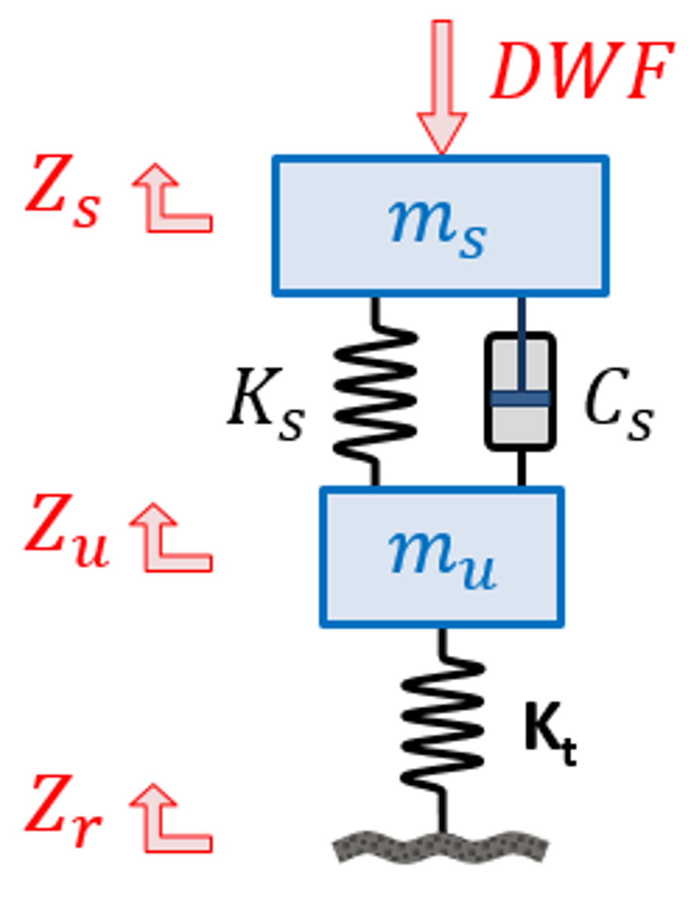
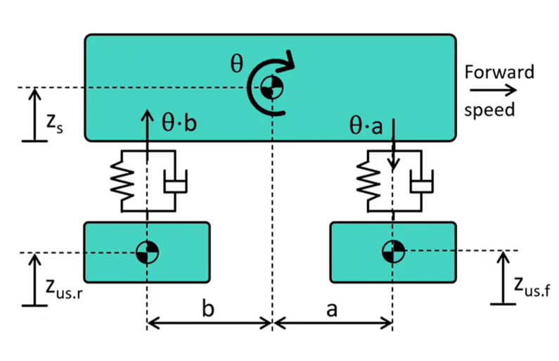

# Vertical Dynamics

## The Power of Isolation

- A system can be isolated from a noise source with effective suspension design and tuning.

- Considering the suspension as a mass-spring-damper system, the transfer function can be considered. Considering transmissibility, it is possible to determine the effectiveness of the system damping.

- Transmissibility = Output / Input
    - Here, the output is the force transmitted and the input is the force applied.
    - For $T>1$, force amplification is taking place. This is at its maximum when the forcing frequency and the natural frequency of the system coincide.
    - For $T<1$, the system is being damped.
    - For $T=1$, the system acts as a rigid body.

- For frequencies greater than $\sqrt{2} \cdot \omega_{n}$ the transmissibility is less than 1 (known as isolation).

- An ideal suspension design has a low natural frequency and is underdamped, maximising the isolation.

## Quarter Car Model

### Equations of Motion

- Considering the forces acting on a single wheel and suspension assembly it is possible to deduce the equations of motion for a quarter-car model.

- In this model, z represents the veritcle movement, for the road, unsprung and sprung masses.

- From the [Vehicle Suspension](./Vehicle%20Suspension.md) documentation, recall the spring and damper forces and applying the appropriate deltas for vertical displacement the forces are given as:

    - Spring Force $F_{spr} = F_{0} + k_{spr} \cdot (z_{us} - z_{s})$
    - Damper Force $F_{damp} = c_{damp} \cdot (\dot{z_{us}} - \dot{z_{s}})$

    - Tyre Force $F_{tyre} = k_{tyre} \cdot (z_{r} - z_{us})$

- The unsprung mass vertical equilibirium is therefore $$F_{tyre} - F_{spr} - F_{damp} - m_{us} \cdot g = m_{us} \cdot \ddot{z_{us}}$$

- The sprung mass vertical equilibirium is therefore $$F_{spr} + F_{damp} - m_{s} \cdot g = m_{s} \cdot \ddot{z_{s}}$$

- This model requires the input of the road profile $z_{r}$.

### Natural Frequency

- The frequency at which a system tends to oscilate in the absence of external forces. $$\omega = 2 \pi f = \sqrt{\frac{k}{m}}$$

- Ride Frequency (1Hz - 5Hz): $$f \approx \frac{1}{2 \pi} \sqrt{\frac{k_{spr}}{m_{s}}}$$

- Wheel Hop Frequency: $$f \approx \frac{1}{2 \pi} \sqrt{\frac{k_{tyre} + k_{spr}}{m_{us}}}$$

- The damping ratio is a measure of how oscillations within a system decay over time following a disturbance. $$\xi = \frac{c_{damper}}{c_{critical}}$$

- The critical damping ratio can be defined as, $$c_{crit} = 2 \cdot \sqrt{k_{spr} \cdot m_{s}}$$

- For a damping ratio equal to 1, it is said that the system is critically damped, while for a damping ratio less than 1, the system is underdamped - desirable for a vehicle. Road vehicles typically have a damping ratio between 0.05 and 0.25, while for performance and competition vehicles it is higher.

- The damping ratio and natural frequency concepts are valuable starting points when designing a performance vehicle, and using the quarter car model the suspension stiffness can be tuned.

## 4 Degrees of Freedom Model

### Equations of Motion

Coupling two quarter car models produces a 4 DoF model. This is the coupling of a quarter car model representing the front axle, and an equivalent quarter car model representing the rear axle.

- As in the quarter car model, the unsprung mass equilibrium can be determined, applied to the front and rear axles in this case:

$$F_{tyre,f} - F_{spr,f} - F_{damp,f} - m_{us,f} \cdot g = m_{us,f} \cdot \ddot{z_{us,f}}$$

$$F_{tyre,r} - F_{spr,r} - F_{damp,r} - m_{us,r} \cdot g = m_{us,r} \cdot \ddot{z_{us,r}}$$

- The sprung mass vertical equilibrium can be given as:

$$F_{spr,f} + F_{damp,f} + F_{spr,r} + F_{damp,r} - m_{s} \cdot g = m_{s} \cdot \ddot{z_{s}}$$

- The sprung mass pitch equilibrium can also be determined by taking moments around the centre of gravity:

$$-a \cdot (F_{spr,f} + F_{damp,f}) + b \cdot F_{spr,r} + F_{damp,r} = I_{s} \cdot \ddot{theta}$$

where a and b are the distance between the centre of gravity line and the front and rear axles respectively. The angle $\theta$ is the pitch angle about the centre of mass as the rear of the vehicle is raised (positive) or lowered (negative).

- As the vehicle pitch movement raises the rear and lowers the front under braking, the front axle suspension is compressed, while the rear is extended. The spring-damper forces are therefore as follows:

- Front Axle: 

$$F_{spr,f} = F_{0,f} + k_{spr,f} \cdot (z_{us,f} - (z_{s} - \theta \cdot a))$$

$$F_{damp,f} = c_{damp,f} \cdot (\dot{z}_{us,f} - (\dot{z}_{s} - \dot{\theta} \cdot a))$$

- Rear Axle: 

$$F_{spr,r} = F_{0,r} + k_{spr,r} \cdot (z_{us,r} - (z_{s} + \theta \cdot b))$$

$$F_{damp,r} = c_{damp,r} \cdot (\dot{z}_{us,r} - (\dot{z}_{s} + \dot{\theta} \cdot b))$$

### Ride Frequency

- The ride frequency ratio is described by the relationship between the front and rear suspension ride frequencies.

- For passenger vehicles, there is a preference to have a bounce motion instead of a pitching motion, and so the rear suspension ride frequency is typically higher than the front axle. Typically $f_{rear} \approx 1.2 \cdot f_{front}$

- In high-performance vehicle applications, comfort is not a consideration as it is in passenger vehicles, so the ride frequency ratio is dictated by the aerodynamics of the vehicle.